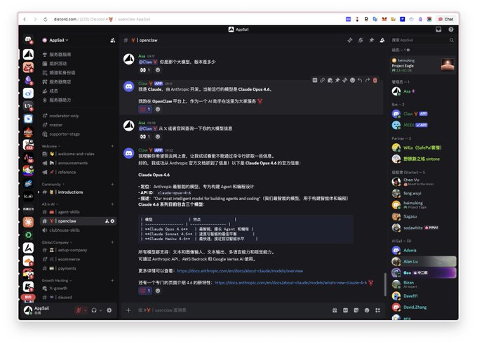

# OpenClaw QMD 本地语义搜索 + ZenMux，节省 20 倍 Token 消耗，爽用 Claude Opus 4.6

> **Author**: AppSail ([@AppSaildotDEV](https://x.com/AppSaildotDEV))
> **Date**: 9:57 AM · Feb 6, 2026
> **Original**: [https://x.com/AppSaildotDEV/status/2019591232083874179](https://x.com/AppSaildotDEV/status/2019591232083874179)
> **Stats**: 76 replies · 251 reposts · 1,028 likes · 2,387 bookmarks · 533,597 views

---


OpenClaw 爆火了两周了，但是太烧 token 了，尤其 Claude 用户，几轮下来就没额度了。几十美元、一百美元不到一天就花完了。

为什么你的 OpenClaw 会变成"吞金兽"？因为当下，在大模型领域，context 即成本啊。

OpenClaw 默认会将过往所有对话塞进上下文，很多时候 agent 塞了一堆无关信息进 context，导致 Token 消耗呈指数级增长，甚至还影响精准度。

本文将结合 QMD 引擎 + ZenMux，教你构建一套"短期工作记忆 + 长期语义存档"的高效架构，总成本降低 90% 以上，节省 20 倍 Token 消耗。

## QMD 简单介绍

QMD 全球最大独立站电商 Shopify 创始人 Tobi 开发的一个本地语义搜索引擎，专为 AI Agent 设计。

可以把它当作 AI 的外挂硬盘。有了它，你可以放心把 AI 的即时记忆（Context Window）设得很小，因为 QMD 在后台守着所有历史档案，随时可以精准召回。

核心原理："查字典"而非"背全书"

- 传统模式：为了让 AI 记住历史，每次都把整本书背一遍，每次对话也会上传整本书
- QMD 模式：只把字典里相关的那一页撕下来贴进去

你付的 Token 只是那一页的钱，不是整本书的钱。这就是最关键的地方。

实际实现上，分三步走：

- Update（扫描）发现新文件/新对话
- Embed（向量化）把文字转成数学坐标
- Query（检索）找出坐标最近的内容

QMD 不是简单切字符，而是根据 Markdown 结构（标题、列表、代码块）来智能分块，带重叠确保语义完整。

三种搜索模式：

- `qmd search`：BM25 关键词，精确查错误码、变量名
- `qmd vsearch`：向量语义，模糊查概念、同义词
- `qmd query`：混合 + 重排序，日常推荐

为什么能省这么多 Token？账单对比：

假设你的项目对话历史累计 50,000 Token：

- 全量历史模式：每轮消耗 50,000，10 轮就是 500,000
- QMD 检索模式：即时窗口 5,000 + 检索召回 1,000 = 每轮 6,000，10 轮只要 60,000

节省 88%，保守一点，我们按照节省 75% 算，4 倍。

对话越长，优势越大，10 轮对话省 88%，100 轮对话省 95%+。全量模式到后面直接爆表，QMD 模式永远稳在 8-10k。

## 在 OpenClaw 中启用 QMD

安装：

```
bun install -g github.com/tobi/qmd
```

基础配置：

```json
{
  "memory": {
    "backend": "qmd",
    "citations": "auto",
    "qmd": {
      "includeDefaultMemory": true,
      "update": {
        "interval": "5m",
        "debounceMs": 15000
      },
      "limits": {
        "maxResults": 6,
        "timeoutMs": 4000
      },
      "scope": {
        "default": "deny",
        "rules": [
          {
            "action": "allow",
            "match": { "chatType": "direct" }
          }
        ]
      },
      "paths": [
        {
          "name": "docs",
          "path": "~/notes",
          "pattern": "**/*.md"
        }
      ]
    }
  }
}
```

关键参数：`backend: "qmd"` 必填，`maxResults` 建议 6，`paths` 按需添加知识库目录。

这里的思路是：让 OpenClaw 自己在后台跑 qmd sidecar，把 `MEMORY.md` + `memory/**/*.md` 和你额外配置的 paths 都编进一个统一索引，定期 `qmd update` + `qmd embed`，自动刷新到向量数据库。

优点非常明显：

- 真正实现「agent 精准回忆」+「减少大段 `MEMORY.md` 直接塞到上下文」，这才是你要的省 token
- 不用自己记得去 `qmd embed`，增量更新、sessions 索引都自动做

另外还有两个隐藏收益：

减少幻觉：Context 过大时，模型容易"长文本疲劳"，逻辑混乱。QMD 提供的上下文精简干练，模型更清醒，减少无效对话，间接省钱。

构建知识库：在 paths 里添加目录即可，无需手动操作：

```json
{
  "paths": [
    {
      "name": "obsidian",
      "path": "~/Obsidian/MyVault",
      "pattern": "**/*.md"
    },
    {
      "name": "docs",
      "path": "~/Documents/技术文档",
      "pattern": "**/*.md"
    }
  ]
}
```

配好就完事了，不用管。

这可太爽了，结合 Discord 做社群运营，社群成员有任何问题，直接 OpenClaw 快速通过 QMD 构建的知识库来回答，还有比这更爽的吗？

## ZenMux：再省 80%

QMD 本地语义搜索大概可以节省 75% 的 token，下面再说一下 ZenMux，大概也可以节省 80% 的 token 成本（官方说法是 5-10 倍价格杠杆，我们按最低算，也就是节省 80%，5 倍杠杆），4倍 × 5倍，差不多就有 20 倍了，你说这篇文章值不值钱。

ZenMux 是一家大模型聚合平台（类似 OpenRouter）。订阅了他们家的 100 刀的 Max 套餐，可以撬动 Anthropic 官方 API 5-10 倍杠杆，价格和中转站差不多了，中转站大多是 7 倍左右杠杆。但是根据我的使用体验，ZenMux 完爆中转站，有非常好的稳定性，不降智。官方甚至提供了保险服务：智能保险检测与自动赔付，全面解决企业对 AI 幻觉、质量不稳定的担忧。

Plan 订阅计划好像是最近推出的，LLM 订阅制也是第一家这么做的吧。目前限量开放了 999 个席位，性价比很高，平常也用得多，就直接冲了，cc 中转站后面就停了。有想法的朋友可以先占个坑试一试，按月付就好。

使用我的邀请链接，[https://zenmux.ai/invite/ATGM7I](https://zenmux.ai/invite/ATGM7I) 可以获取 25% 的奖励优惠，不过仅限购买 tokens。

Anthropic 刚刚发布了 Claude Opus 4.6，ZenMux 也是第一批就接入了，我也是立马就接入到 openclaw，发到 Discord，社群已经可以使用了。



想加入这个 Discord 频道，一起玩耍 openclaw 的朋友请点击：[https://discordhunt.com/servers/appsaildev-1369133651891327110](https://discordhunt.com/servers/appsaildev-1369133651891327110)

目前给 Discord 频道已经配置了 ZenMux 100刀订阅、Claude 订阅、ChatGPT Codex Auth、3个 Antigravity Auth，用完为止！

配置很简单，官方有详细的文档，照着配置几分钟就搞定了：

```json
{
  "models": {
    "mode": "merge",
    "providers": {
      "zenmux": {
        "baseUrl": "https://zenmux.ai/api/v1",
        "apiKey": "sk-ss-v1-your-api-key-here",
        "api": "openai-completions",
        "models": [
          {
            "id": "deepseek/deepseek-chat",
            "name": "DeepSeek Chat via ZenMux",
            "reasoning": false,
            "input": ["text"],
            "cost": { "input": 0, "output": 0, "cacheRead": 0, "cacheWrite": 0 },
            "contextWindow": 64000,
            "maxTokens": 8192
          },
          {
            "id": "openai/gpt-5.2",
            "name": "GPT-5.2 via ZenMux",
            "reasoning": false,
            "input": ["text", "image"],
            "cost": { "input": 0, "output": 0, "cacheRead": 0, "cacheWrite": 0 },
            "contextWindow": 200000,
            "maxTokens": 8192
          },
          {
            "id": "google/gemini-3-pro-preview",
            "name": "Gemini 3 Pro via ZenMux",
            "reasoning": false,
            "input": ["text", "image"],
            "cost": { "input": 0, "output": 0, "cacheRead": 0, "cacheWrite": 0 },
            "contextWindow": 200000,
            "maxTokens": 8192
          },
          {
            "id": "anthropic/claude-opus-4.6",
            "name": "Claude Opus 4.6 via ZenMux",
            "reasoning": false,
            "input": ["text", "image"],
            "cost": { "input": 0, "output": 0, "cacheRead": 0, "cacheWrite": 0 },
            "contextWindow": 200000,
            "maxTokens": 8192
          }
        ]
      }
    }
  },
  "agents": {
    "defaults": {
      "model": {
        "primary": "zenmux/anthropic/claude-opus-4.6"
      },
      "models": {
        "zenmux/deepseek/deepseek-chat": {},
        "zenmux/openai/gpt-5.2": {},
        "zenmux/google/gemini-3-pro-preview": {},
        "zenmux/anthropic/claude-opus-4.6": {}
      }
    }
  }
}
```

注意：请将 `sk-ss-v1-your-api-key-here` 替换为您的实际 ZenMux API Key（订阅后在当前页面就创建订阅 API Key）。

## 总结

两招组合拳：

- QMD 本地语义搜索：省 75% token，把 50k 的上下文压到 6k
- ZenMux 聚合平台：再省 80% 费用，5-10 倍价格杠杆

综合下来，原本 100 刀的消耗，现在可能只要 4-5 刀，节省 20 倍 Token 消耗，爽用 Claude Opus 4.6 啊。这才是 OpenClaw 正确的打开方式。

都看到这里了，请帮忙转发这篇文章哈，感谢！

下篇文章主要分享 QMD 的深入玩法，如何调优和在 Discord 使用 QMD 构建知识库，回答社群问题。

## 相关资源

- [QMD GitHub](https://github.com/tobi/qmd)
- [OpenClaw Memory 文档](https://docs.openclaw.ai/concepts/memory#qmd-backend-experimental)
- [ZenMux](https://zenmux.ai/invite/ATGM7I)
